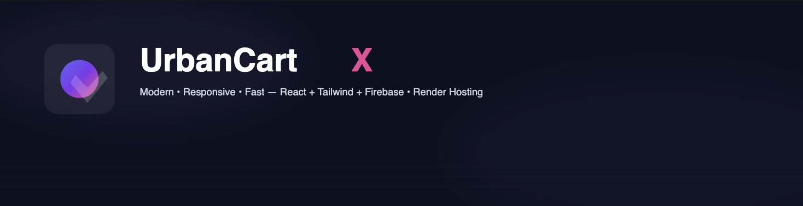
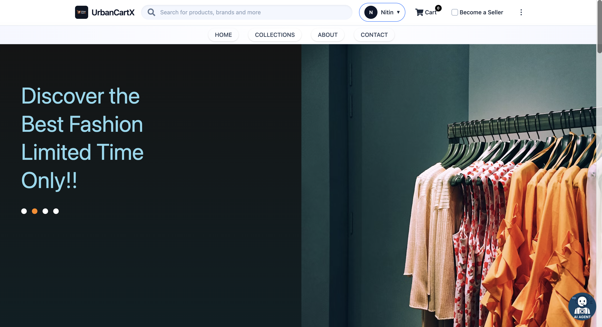
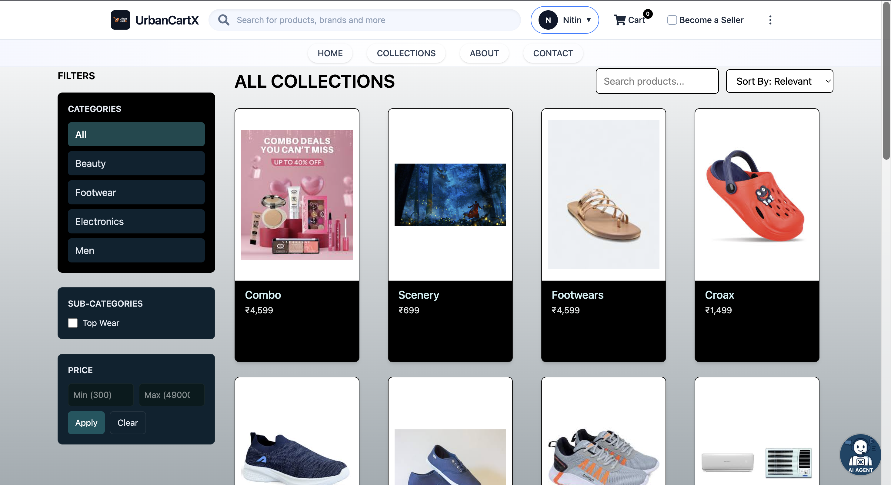
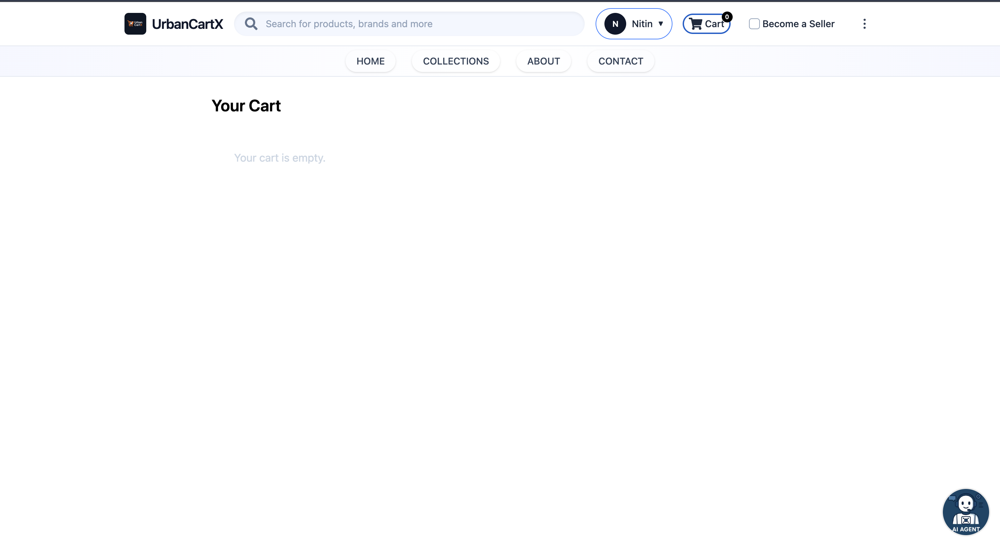
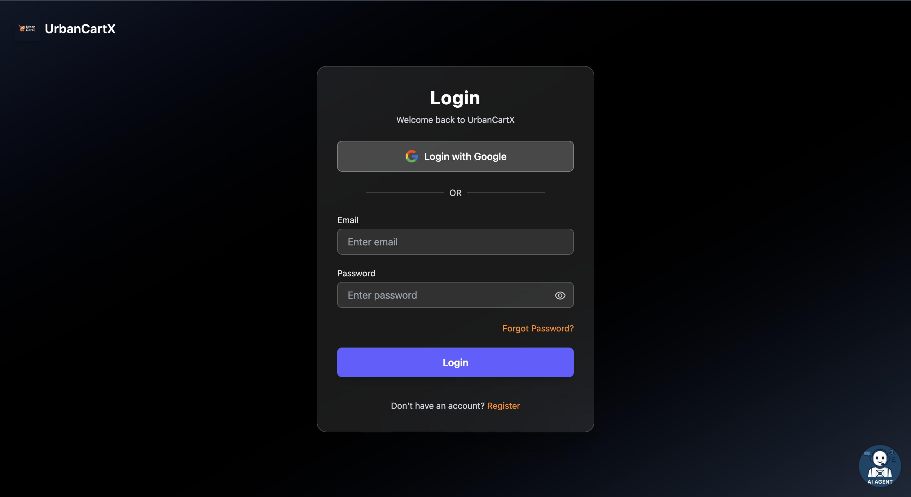
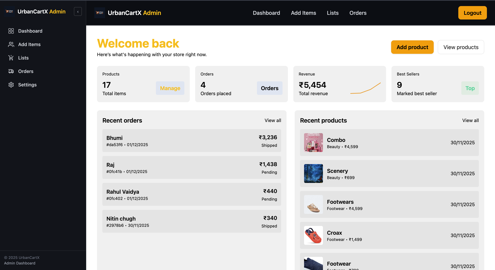
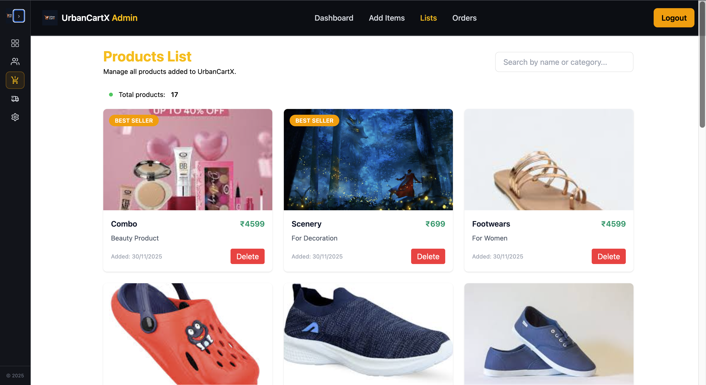
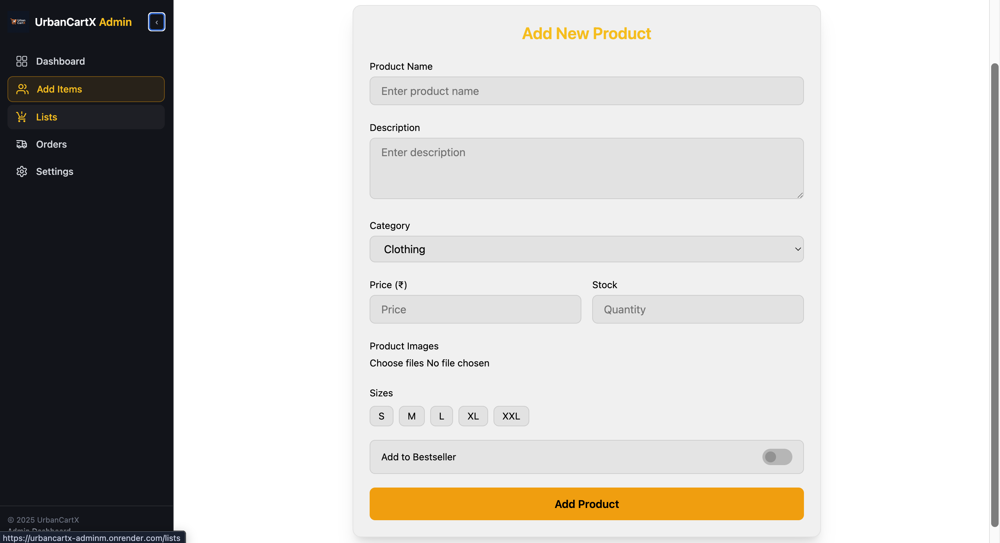
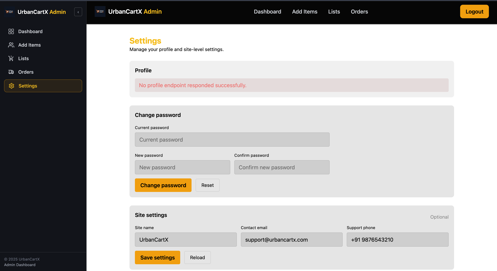

  

<h1 align="center">🛒 UrbanCartX</h1>

A Modern & Fully Responsive E-Commerce Web Application — Built with React, Tailwind CSS, Firebase & Render

  
  
  
  
  
  
  

---

## 🚀 Live Demo 
🔗 **Render URL:[** *https://your-render-url.onrender.com* ](https://urbancartx-frontendu.onrender.com/) 

---

## ✨ Features

### 🎨 UI & UX
- Fully responsive modern design  
- Smooth animations using **Framer Motion**  
- Tailwind-powered beautiful layouts  
- Smart Navbar  
  - Auto-hide on scroll (mobile)  
  - Active link underline  
  - Smooth section scroll  

### 🛍️ E-Commerce Functionality
- Product listing  
- Product details page  
- Add to Cart / Remove from Cart  
- Real-time cart counter  
- Persistent cart (Local Storage / Firestore)

### 🔐 Authentication
- Google Login (Firebase Authentication)

### ⚡ Performance
- Lazy-loaded components  
- Optimized assets  
- Context API for global state  

### 🌙 Dark Mode
- One-click dark mode toggle  
- Remembered preference  

---

## 🧰 Tech Stack

| Category | Technologies |
|---------|--------------|
| **Frontend** | React, React Router, Tailwind CSS, Framer Motion |
| **State Management** | Context API |
| **Authentication** | Firebase Authentication |
| **Database** | Firebase Firestore (optional) |
| **Hosting** | Render |
| **Build Tool** | Vite |

---

## 📁 Project Structure

UrbanCartX/
├── public/
├── src/
│ ├── assets/
│ ├── components/
│ ├── context/## 

📸 Screenshots

### 🏠 Home Page

### 🛍️ Product Listing

### 🧺 Cart Page

### 🔐 Google Login

│ ├── firebase/
│ ├── pages/
│ ├── utils/
│ ├── App.jsx
│ └── main.jsx
├── package.json
├── vite.config.js
└── README.md

---

## 🛠️ Admin Panel (UrbanCartX Admin)

UrbanCartX includes a fully functional **Admin Panel** where administrators can manage the entire store — products, categories, settings, and dashboard insights.

The Admin Panel is built with:
- **React + Tailwind CSS**
- **Firebase Authentication (Admin Protected)**
- **Firestore Database**
- **Reusable UI components**
- **Secure restricted access**

### 🔑 Admin Features

#### 📊 **Dashboard**
- Overview of store stats  
- Total products, orders, users, categories  
- Quick analytics cards  
- Recent activities  

#### 🛍️ **Product Management**
- Add new products  
- Edit products  
- Delete products  
- Upload & manage images  
- Real-time Firestore sync  

#### 📂 **List Views**
- Products list  
- Categories list  
- Users list (optional)  
- Sort, filter, and search  

#### ⚙️ **Admin Settings**
- Theme settings (Dark / Light)
- Admin profile info  
- Logout / security management  

---

## 📸 Admin Panel Screenshots

### 🖥️ Dashboard  

### 📦 Product List  

### ➕ Add Product  

### ⚙️ Settings  

---

🤝 Contributing

Contributions are welcome!
Follow these steps: fork → clone → branch → commit → push → PR

👨‍💻 Author 
Nitin Chugh
Frontend Developer — React | Tailwind | Firebase
🔗 GitHub: https://github.com/NitinChugh13

⭐ Support

If you like this project, please star the repository — it helps grow the project!

